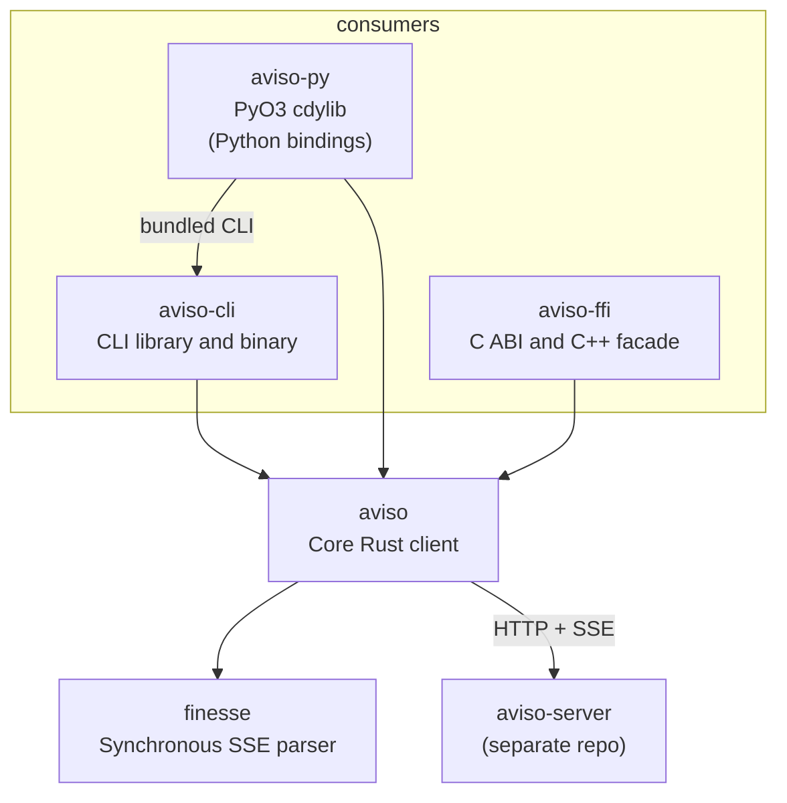

<!--
SPDX-FileCopyrightText: 2026 European Centre for Medium-Range Weather Forecasts (ECMWF)
SPDX-License-Identifier: Apache-2.0
-->

# Architecture

A view of the shared Rust client and its language bindings.

## Crate dependencies

The client has five product crates. The workspace also includes `aviso-e2e`,
an unpublished package for end-to-end tests. Arrows below point from a crate
to its dependency; the server connection is a network call.

The CLI and language bindings share the core library. The Python extension
also depends on the CLI library so the Python distribution can bundle the
`aviso` command. The core library does not depend on the CLI or any binding
crate.

## The crates in more detail

### `aviso` (core library)

The shared client behavior lives here. Adapters handle language-specific
interfaces and application setup.

- **HTTP**: `reqwest` with rustls for TLS.
- **SSE**: an in-tree parser (`finesse`) implementing the WHATWG parsing
  algorithm. The reconnect loop is owned, not delegated; off-the-shelf SSE
  crates assume the WHATWG `Last-Event-ID` mechanism, but aviso-server's resume
  contract is `from_id`/`from_date` in the POST body, which requires a re-POST
  on every reconnect.
- **Reconnect supervisor**: a single task per `watch()` call, driving a small
  state machine.
- **State store**: a trait with two built-in implementations, an in-memory store
  and a JSON file store with crash-safe atomic writes.
- **AuthProvider**: an async trait with five built-in providers.
- **Trigger dispatcher**: a crate-private enum with a public builder API.

### `aviso-cli`

The CLI library resolves layered config (flag > env > file > default),
builds an `AvisoClient`, attaches a `JsonFileStore`, parses listener YAML,
and dispatches subcommands. A small binary exposes it as `aviso`.

The standalone binary and the Python-bundled command call the same
`aviso_cli::run` entry point.

The CLI's responsibilities are mostly about composition and I/O surfaces. It
does not implement any of the SSE, reconnect, or trigger logic; that is all in
the library.

### `aviso-py`

The PyO3 extension crate. Built as a `cdylib` for the Python wheel and as an
`rlib` so the workspace `cargo test` sees its types. Exposes a synchronous
`AvisoClient` and an asynchronous `AsyncAvisoClient` over the same channel the
Rust core uses, plus typed value classes, the trigger builder, auth providers,
state stores, and the exception hierarchy.

The distribution and public Python package are named `pyaviso`. The compiled
extension is `pyaviso._native`; `pyaviso/__init__.py` re-exports its classes
and defines Python-side enums and type aliases.

The installed `aviso` command and `python -m pyaviso` both enter through
`pyaviso.__main__:main`. A native bridge releases the GIL and calls the CLI
library in-process, rather than starting a separate executable.

### `aviso-ffi`

The C adapter exposes a stable ABI over the core library and builds static
and shared libraries. Its committed `aviso.h` header is generated with
`cbindgen`.

The hand-written `aviso.hpp` header provides a C++17 facade over that ABI.
It wraps C handles with RAII and translates errors into C++ exceptions.
It supports blocking calls, asynchronous calls returning `std::future`, and
callback-based listeners. The facade is header-only, not a separate Rust crate.

### `finesse`

The SSE parser, kept separate so the protocol can evolve without churning the
rest of the library. It owns no transport, no async runtime, and no aviso
semantics: the caller drives the parser by feeding bytes in and draining typed
frames out.

The parser holds bytes until a line terminator or a blank line arrives, so it
bounds how much it will hold: 16 MiB for one line and 32 MiB of `data:` for
one event by default. A notification arrives as one line, and the server's
store passes on at most a few MiB, so a large polygon is never refused. A
server
that exceeds a bound ends the watch with a stream protocol error rather than
being kept in memory. Each byte is examined once, so a long line costs time
proportional to its length.

## Data flow at runtime

When you call `client.watch(WatchRequest::watch("mars"))`:

1. The listening surface constructs a `WatchRequest`, derives a resume key, and
   spawns a supervisor task.
2. The supervisor reads the cursor from the state store (if one is configured).
3. The supervisor sends a `POST /api/v1/watch` to the server with the filter and
   the cursor.
4. The server replies with an SSE stream. The supervisor reads chunks, feeds
   them into the `finesse` parser, and turns parsed frames into `Notification`
   values.
5. For each notification, the supervisor:
   - runs every configured trigger,
   - persists the previous notification's sequence to the state store (next-send
     commit),
   - sends the current notification on a bounded channel to the consumer.
6. On a `connection-closing` event, a transport error, a heartbeat timeout, or a
   5xx, the supervisor reconnects using the right backoff for the cause.
7. On a terminal error (4xx other than 401, second 401 after refresh, required
   trigger failure exhausted retries, history gap), the supervisor closes the
   stream with the error and exits.

Dropping the `NotificationStream` cancels the supervisor cooperatively through a
oneshot channel; the supervisor exits within one event-loop tick.

### Startup confirmation

The connection runner validates HTTP 200 and the SSE media type before decoding
the body. An opening gate consumes frames until the expected Aviso control
arrives: `connection_established` for live-only or `replay_started` for a
resolved historical cursor. Headers and opening share a ten-second deadline.
Only then does it transition to `Connected`, reset backoff, and publish
readiness.

`NotificationStream::subscribe_ready()` exposes a watch receiver whose value
stays true after the first handshake. The CLI uses it for its `Listening`
status; it does not infer readiness from log text or wait for the first
notification. Retry telemetry uses tracing in the listener span, with causes
and delays coalesced over five seconds. Status stays on stderr.

`WatchRequest::with_startup_timeout` optionally bounds the supervisor until the
first handshake, including cursor lookup, authentication, and retry sleeps.
The initial budget is removed once readiness becomes true. It never wraps
notification dispatch, persistent checkpoint writes, or consumer backpressure.
The CLI sets this budget to 30 seconds unless overridden; bindings inherit the
core's unlimited initial retry policy and per-connection protocol validation.

## Cancellation and shutdown

aviso is cooperative everywhere. There are three cancellation paths:

- **Per-stream**: dropping the `NotificationStream` drops a oneshot sender; the
  supervisor's `select!` notices and exits.
- **Parent-cascade**: dropping the last `AvisoClient` clone trips a
  `tokio::sync::watch` flip that every child supervisor observes.
- **Ctrl+C in the CLI**: a signal handler triggers a graceful drain via the same
  per-stream mechanism for every active listener.

The supervisor's `select!` is `biased` so cancellation cannot be starved by a
fast stream. Every supervisor await (auth header, HTTP send, chunk read, channel
send) is wrapped in the cancel arm.

## Why a single supervisor per listener

A bounded channel (capacity 128 by default; 1 when a state store is configured)
sits between the supervisor and the consumer. The channel applies TCP
backpressure end to end: when the consumer falls behind, the supervisor's `send`
blocks, which makes it stop reading bytes from the wire, which throttles the
server.

When a state store is configured, the channel capacity drops to 1 so the
supervisor's commit-of-previous-notification is forced to happen before the
consumer can pull the next one. The user-facing contract is "pulling item N+1
implies item N is durable", and capacity 1 is what makes that true.

## Watch connections

A watch keeps one HTTP request open for as long as it runs. Over HTTP/2, all
requests from one HTTP client to a server share a single TCP connection, and
servers and proxies limit how many requests one connection may carry at once
(nginx allows 128 by default, HAProxy 100). A watch past that limit is not
refused: its request waits for a free stream, which never comes while the
other watches stay open.

The client therefore keeps two kinds of HTTP client. Ordinary requests
(`notify`, `schema`, admin calls) use one, with the request timeout the caller
configured. Watches use a small set of others, each carrying at most 64
watches. When every client in the set is full, the next watch gets a new
client and therefore a new connection; when a watch ends its slot is freed,
and clients left idle at the end of the set are released. The watch clients
have no request timeout, because a watch's response is meant to stay open;
the ten-second opening deadline and the heartbeat watchdog bound a stalled
watch instead. Clones of an `AvisoClient` share both.

A proxy that allows fewer than 64 streams per connection makes the watches
past its limit fail the opening deadline with "no response from the server".

## The state-store contract

The store is strictly monotonic: a `put` whose sequence is at or below the
existing on-disk value is silently a no-op. This is what guarantees the cursor
never moves backwards, even across concurrent writers or after operator errors
editing the file.

For multiple processes, the file store uses an advisory `flock` on a sidecar
lockfile. The lockfile is separate from the data file because the atomic-rename
pattern would otherwise invalidate the lock between operations.

A failed `put` leaves both memory and disk unchanged. Aside: `put` and `delete`
on the file store are not cancellation-safe; drive them to completion. The CLI
does this.

## What is intentionally not here

- **Client-side schema validation**. The server is the single source of truth.
  aviso does not depend on `aviso-validators` and does not pre-validate
  notifications.
- **Auto-retry on `notify`**. A `POST` that fails after the request body has
  been sent might have been processed; a blind retry would risk a duplicate.
  When a server-side idempotency-key contract becomes available the policy will
  be revisited.
- **A metrics surface**. The core emits structured `tracing` events. Consumers
  that need Prometheus or OpenTelemetry metrics build a thin adapter on top.

## Where to go next

- [Library guide](./lib-guide.md): how to use the library from your own code.
- [Contributing](./contributing.md): tests, gates, the workflow.
