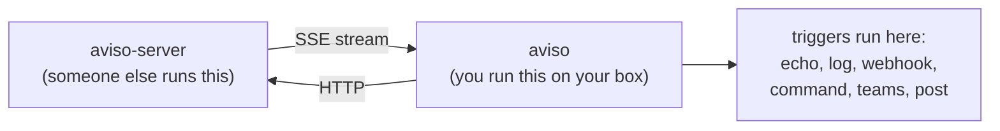

# What aviso is

aviso is ECMWF's notification system for data-driven workflows. It runs as a
client-server pair: aviso-server is the source of truth for streams of events;
the client connects, asks for the events you care about, and tells you when they
arrive. This page is about the client.

## The pieces

The server is the source of truth. Your aviso client subscribes, processes
incoming notifications through any triggers you have configured, and remembers
where it left off so it can resume cleanly after a restart.

## What an event looks like

The server speaks in events. Every event has:

- a **type** that names what kind of thing happened (for example `mars`),
- a set of **identifiers** that describe which one (`class=od`, `stream=oper`, a
  date, a step, and so on),
- an optional JSON **payload** with whatever the publisher attached (often the
  location of a file),
- a **sequence number** that strictly increases per event type.

You ask aviso to listen for a type and the identifiers you care about. The
server streams every matching new event to you over a long-lived HTTP
connection.

## Three ways to use it

| You want to | Use | Read next |
|---|---|---|
| Run aviso in a terminal or a script | The `aviso` CLI | [CLI overview](../cli/overview.md) |
| Embed aviso in a Rust program | The `aviso` Rust library | [Library guide](../developers/lib-guide.md) |
| Call aviso from Python | The native `aviso` package, or the CLI through `subprocess` | [Python overview](../python/overview.md) |

The CLI and the library are the same code. Pick the surface that matches the
program you are writing.

## What aviso takes care of for you

- **Reconnects**. The server intentionally closes a listener every so often.
  aviso reconnects without losing your place.
- **Resume**. When the process restarts, aviso picks up from the last
  notification it fully processed. Normal restarts avoid skipping events.
- **At-least-once delivery**. Each notification reaches your triggers at least
  once. Design your triggers to be idempotent.
- **Backpressure**. If your code is slow to handle a notification, aviso slows
  down its read from the network rather than buffering forever in memory.
- **Heartbeat watchdog**. If the network goes quiet for too long, aviso assumes
  the connection is dead and reconnects.

## Where to go next

- New here and want to try it in 5 minutes? [Quickstart](./quickstart.md).
- Want to set up a long-running listener?
  [Listen for notifications](../cli/publish-and-listen.md).
- Want to understand the model in more depth? [Concepts](./concepts.md).
