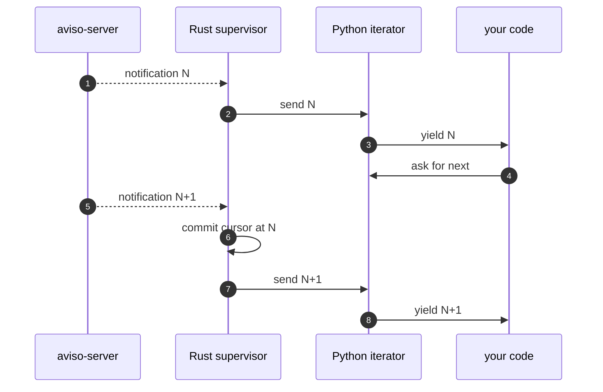

# State and resume

The aviso client delivers at-least-once. A notification advances its stream's resume cursor only after the consumer has accepted it (drawn it off the iterator) and any required triggers have succeeded. Across reconnects and across process restarts the supervisor picks up at the last committed cursor and re-delivers anything not yet committed.

## How it works

Each watch derives a stable resume key from the base URL, the event type, the canonical filter body, and a schema fingerprint. The key is the address under which the cursor is stored.

The supervisor's commit policy is commit-on-next-send: before sending notification N+1 to the consumer iterator, it commits N. Pulling N+1 from the iterator therefore implies N is durable.



If the process crashes between sending N and committing N, the next start re-delivers N. If the process crashes before sending N at all, the next start re-delivers N. At-least-once.

## Where state lives

Two implementations of the state store ship:

- `aviso.MemoryStore()`: keeps state in process memory. Dies with the process. Use it in tests and one-shot scripts that do not need to survive restart.
- `aviso.JsonFileStore(path)`: writes a JSON file with crash-safe atomic rename plus a sidecar lockfile so cooperating processes on a local filesystem can share the cursor. The path defaults to `~/.config/aviso/state.json` in the CLI; Python users pass whatever path makes sense.

```python
import aviso

client = aviso.AvisoClient(
    base_url="https://aviso.example.org",
    state_store=aviso.JsonFileStore("~/.config/aviso/state.json"),
)
```

The store fails on construction if the parent directory does not exist; create it first:

```python
import pathlib

path = pathlib.Path.home() / ".config" / "aviso" / "state.json"
path.parent.mkdir(parents=True, exist_ok=True)

client = aviso.AvisoClient(
    base_url="https://aviso.example.org",
    state_store=aviso.JsonFileStore(path),
)
```

## Local filesystems only

`JsonFileStore` uses `flock`, which is not safe over NFS or CIFS. Use a local filesystem (ext4, xfs, apfs, ntfs) for the state file.

## Flush on exit

By default the cursor is committed when the next notification arrives, which means the LAST notification of a session is never committed. For an interactive operator pressing Ctrl+C, the next run replays that last notification. Set `flush_cursor_on_exit=True` and call `iter.close()` to commit the last notification before exit:

```python
client = aviso.AvisoClient(
    base_url="https://aviso.example.org",
    state_store=aviso.JsonFileStore("~/.config/aviso/state.json"),
    flush_cursor_on_exit=True,
)

iterator = client.listen("mars", filter={"class": "od"})
try:
    for n in iterator:
        process(n)
finally:
    iterator.close()
```
