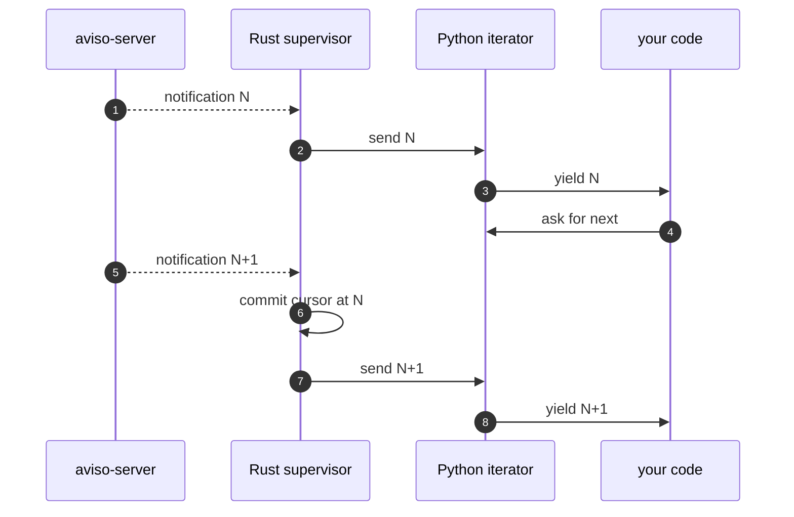

# State and resume

The aviso client delivers at-least-once. A notification advances its stream's
resume cursor only after the consumer has accepted it (drawn it off the
iterator) and any required triggers have succeeded. Across reconnects and across
process restarts the supervisor picks up at the last committed cursor and
re-delivers anything that did not get committed.

The examples on this page use `test_polygon` as the event type. If your server
does not have it configured, replace the event type and identifier fields with
one of your own; the call shape is the same. See
[What is on your server](./quickstart.md#what-is-on-your-server) in the
quickstart for how to discover what is configured.

## How it works

Each watch derives a stable resume key from the base URL, the event type, the
canonical filter body, and a schema fingerprint. That key is the address under
which the cursor is stored.

The commit policy is commit-on-next-send: before sending notification N+1 to the
consumer iterator, the supervisor commits N. Pulling N+1 from the iterator
therefore implies N is durable.

Checkpoints never move backwards within a watch session. An out-of-order
notification still runs its triggers and reaches the iterator, but does not
replace a higher pending or committed sequence. Only successfully sent
notifications can advance the pending checkpoint; receiving a higher sequence
alone is not enough. A notification whose required trigger fails cannot advance
the pending checkpoint, including when exit flushing is enabled. A previously
sent notification may already have been committed before that failure. A
sequence checkpoint is not a per-event acknowledgement or a guarantee that
duplicates are suppressed.



If the process crashes between sending N and committing N, the next start
re-delivers N. If the process crashes before sending N at all, the next start
re-delivers N. At-least-once.

## A complete resuming listener

```python
"""Listen for notifications with a persistent cursor.

The first run reads from the live edge. Every subsequent run resumes
from the last sequence the supervisor committed.
"""

import os
import pathlib
import pyaviso

state_path = pathlib.Path.home() / ".config" / "aviso" / "state.json"
state_path.parent.mkdir(parents=True, exist_ok=True)

client = pyaviso.AvisoClient(
    base_url=os.environ["AVISO_BASE_URL"],
    auth=pyaviso.Env(),
    state_store=pyaviso.JsonFileStore(state_path),
)

for notification in client.listen(
    "test_polygon", filter={"polygon": [[0, 0], [1, 0], [1, 1], [0, 0]]}
):
    print(f"seq={notification.sequence}")
```

Run it once and Ctrl+C after seeing a few notifications. Run it again and the
iterator picks up at the sequence after the last one that was committed.

## Where state lives

Two store implementations are included with the package:

- `pyaviso.MemoryStore()` keeps the cursor in process memory. It dies with the
  process. Use it in tests and one-shot scripts that do not need to survive
  restart.
- `pyaviso.JsonFileStore(path)` writes a JSON file with a crash-safe atomic
  rename and a sidecar lockfile so cooperating processes on a local filesystem
  can share the cursor.

<!-- not-runnable -->
```python
import pyaviso

client = pyaviso.AvisoClient(
    base_url="https://aviso.example.org",
    state_store=pyaviso.JsonFileStore("/var/lib/aviso/state.json"),
)
```

The store fails on construction if the parent directory does not exist. Create
it first:

```python
"""Construct the state file's parent directory before passing it to the client."""

import os
import pathlib
import pyaviso

path = pathlib.Path.home() / ".config" / "aviso" / "state.json"
path.parent.mkdir(parents=True, exist_ok=True)

client = pyaviso.AvisoClient(
    base_url=os.environ["AVISO_BASE_URL"],
    auth=pyaviso.Env(),
    state_store=pyaviso.JsonFileStore(path),
)

print(f"using state file: {path}")
```

## Local filesystems only

`JsonFileStore` uses `flock`, which is not safe over NFS or CIFS. Use a local
filesystem (ext4, xfs, apfs, ntfs) for the state file. If you need to share a
cursor across machines, run one process and have the others consume its output,
or write your own state store against a coordination service.

## Flush on exit

The default commit policy commits N when N+1 arrives. The very last notification
of a session is therefore never committed automatically: a Ctrl+C while waiting
for the next publish leaves that last notification uncommitted, and the next run
replays it.

For interactive operators who want a clean Ctrl+C, set
`flush_cursor_on_exit=True` on the client and call `iter.close()` in a
`finally`:

```python
"""Commit the last notification before exit."""

import os
import pathlib
import pyaviso

state_path = pathlib.Path.home() / ".config" / "aviso" / "state.json"
state_path.parent.mkdir(parents=True, exist_ok=True)

client = pyaviso.AvisoClient(
    base_url=os.environ["AVISO_BASE_URL"],
    auth=pyaviso.Env(),
    state_store=pyaviso.JsonFileStore(state_path),
    flush_cursor_on_exit=True,
)

with client.listen(
    "test_polygon", filter={"polygon": [[0, 0], [1, 0], [1, 1], [0, 0]]}
) as iterator:
    for notification in iterator:
        print(notification.sequence)
```

The iterator's `with` form calls `close()` automatically on exit (whether the
loop body returns, raises, or breaks), so the supervisor's final cursor flush
always lands. Without `flush_cursor_on_exit=True`, the at-least-once contract
still holds; you just see one replayed notification per restart.

## With `AsyncAvisoClient`

Both state stores work identically with the async client. The async iterator is
an `async with` context manager that calls `aclose()` on exit:

<!-- not-runnable -->
```python
import asyncio
import pyaviso

async def main() -> None:
    client = pyaviso.AsyncAvisoClient(
        base_url="https://aviso.example.org",
        state_store=pyaviso.JsonFileStore("/var/lib/aviso/state.json"),
        flush_cursor_on_exit=True,
    )
    async with client.listen(
        "test_polygon", filter={"polygon": [[0, 0], [1, 0], [1, 1], [0, 0]]}
    ) as iterator:
        async for notification in iterator:
            print(notification.sequence)

asyncio.run(main())
```
